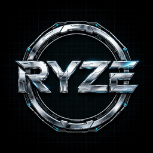

# RYZE Game Launcher

**A modern Windows desktop game launcher for quest enthusiasts.**

---

## Features

<table align="center">
  <tr>
    <td>
      <b>Game Store</b> 
      Browse and search a large public game database with category filters and popular aliases
    </td>
    <td>
      <b>My Library</b> 
      Add games to your personal library, mark favorites, and keep track of what you play
    </td>
  </tr>
  <tr>
    <td>
      <b>Discord Rich Presence</b> 
      Launch a game with one click and show "Playing" status on Discord
    </td>
    <td>
      <b>Recently Played</b> 
      Automatically tracked on the home screen
    </td>
  </tr>
  <tr>
    <td>
      <b>Auto-Update</b> 
      In-app notifications, one-click download with progress, and install & restart
    </td>
    <td>
      <b>Customizable Themes</b> 
      Dark blue, black, and light themes with startup options and zoom controls
    </td>
  </tr>
  <tr>
    <td>
      <b>Desktop Shortcuts</b> 
      Create a shortcut for any game in one click
    </td>
    <td>
      <b>System Tray</b> 
      Runs quietly in the tray - closing the window keeps the launcher running
    </td>
  </tr>
  <tr>
    <td colspan="2" align="center">
      <b>What's New</b> 
      See point-by-point release notes after every update
    </td>
  </tr>
</table>

---

## Installation

**Step 1:** Go to the [latest release](https://github.com/its-samir20/ryze-game-launcher/releases/latest)

**Step 2:** Download `RYZE-Game-Launcher-Setup-*.exe`

**Step 3:** Run the installer (Windows SmartScreen may ask you to confirm - this is normal for unsigned apps)

**Step 4:** The installer automatically installs the required **Microsoft Visual C++ Redistributable** if it's missing

**Step 5:** Launch **RYZE Game Launcher** from your desktop or Start Menu

> The app is updated automatically - when a new version is released, you'll get an in-app notification and can install it with one click.

---

## How Updating Works

**1.** A popup appears when a new update is available

**2.** Click the popup and select **Download Update** (shows live progress)

**3.** Click **Install & Restart** - the app closes, the installer runs, and the updated version reopens automatically

---

## Tech Stack

| Technology | Purpose |
|-----------|---------|
|  | Desktop runtime |
|  | UI logic |
|  | Styling |

---

## Release Assets

| File | Purpose |
|------|---------|
| `RYZE-Game-Launcher-Setup-*.exe` | Installer (used for manual installs) |
| `*.exe.blockmap` | Differential update blockmap |
| `latest.yml` | Auto-update metadata for `electron-updater` |

---

## Developer

Built by [AL Jame Samir](https://github.com/its-samir20) - experimental, non-profit software.

---

## License

This is an independent, non-commercial project. RYZE Game Launcher is **not affiliated with**, endorsed by, or sponsored by any game platform.

---

  <b>Made with care by Samir</b>

